# screen_ui_app

# flutter UI From day 1 to day 10

# day 0
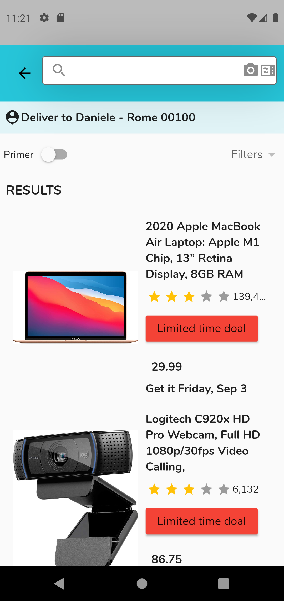

# day 1
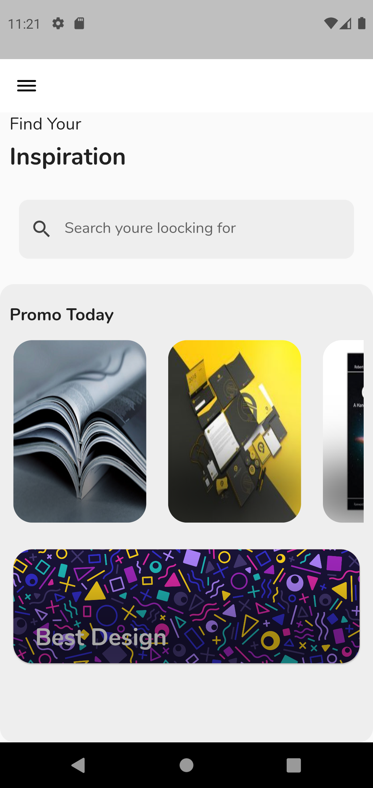

# day 2
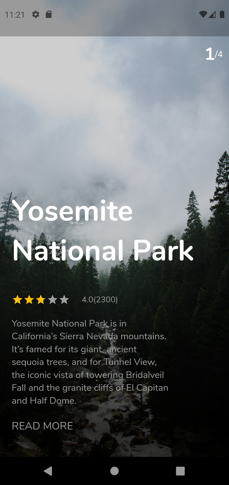&nbsp;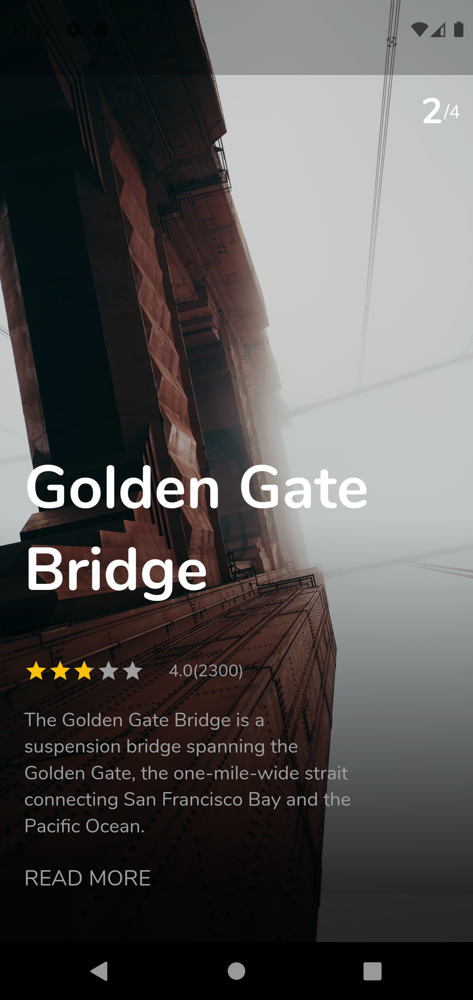

# day 3
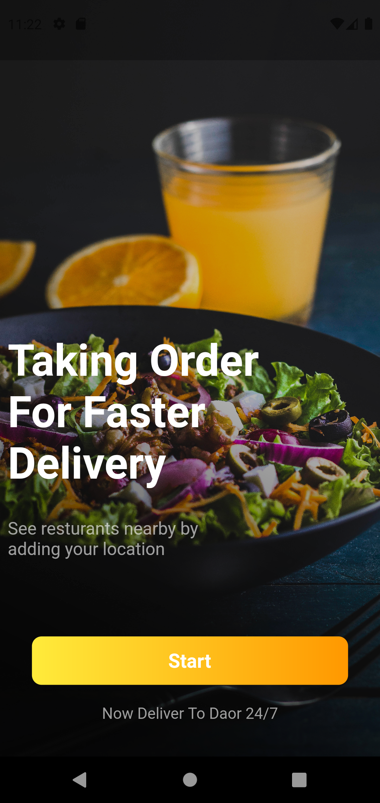&nbsp;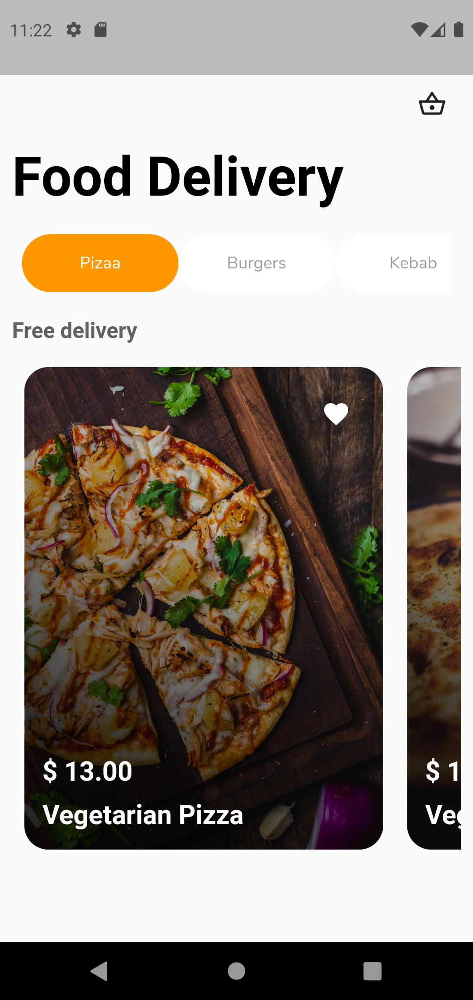

# day 4
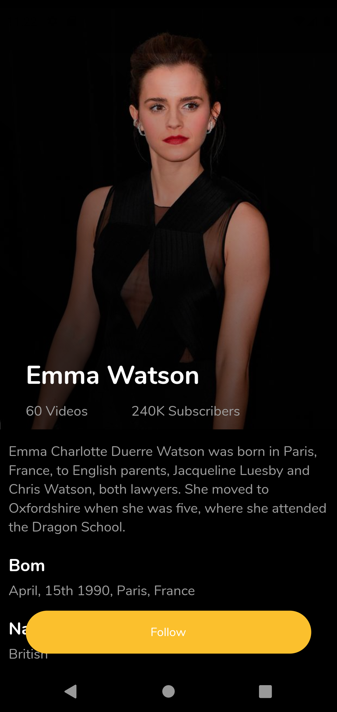&nbsp;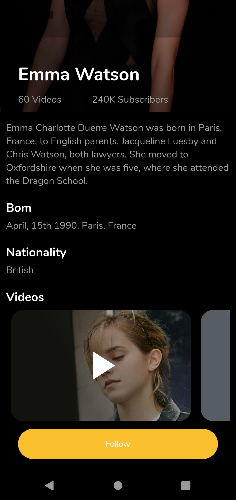

# day 5

# day 6
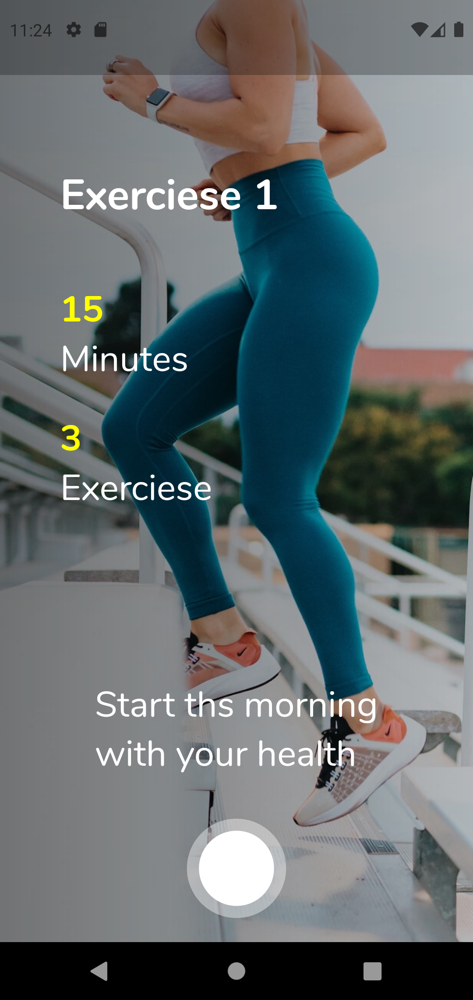&nbsp;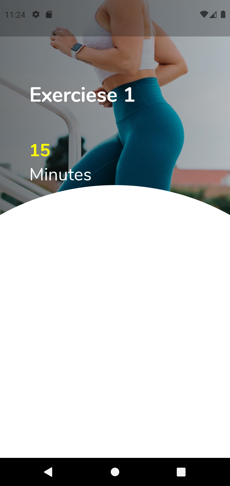&nbsp;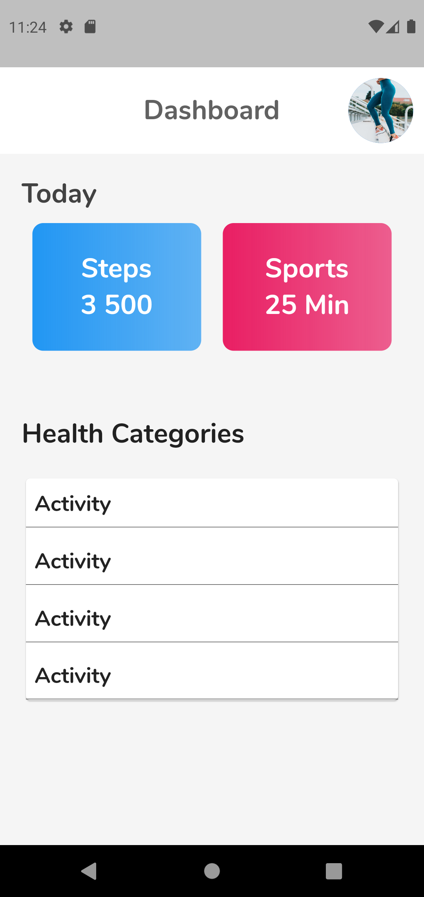

# day 7
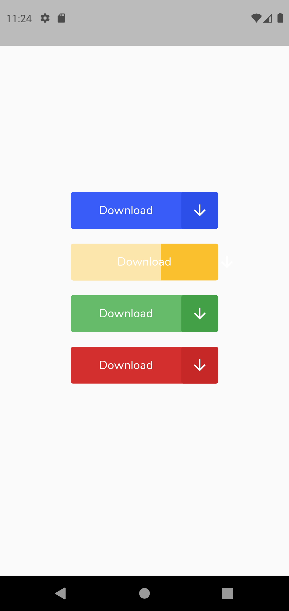&nbsp;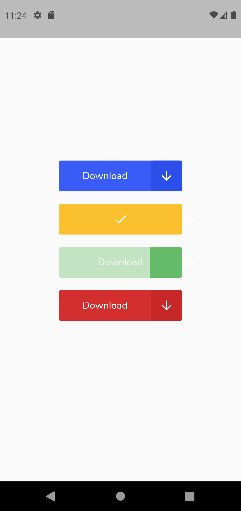

# day 8
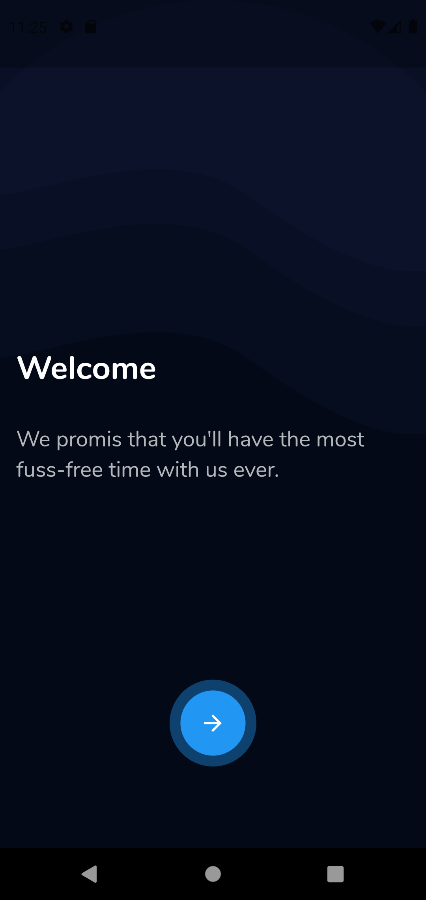&nbsp;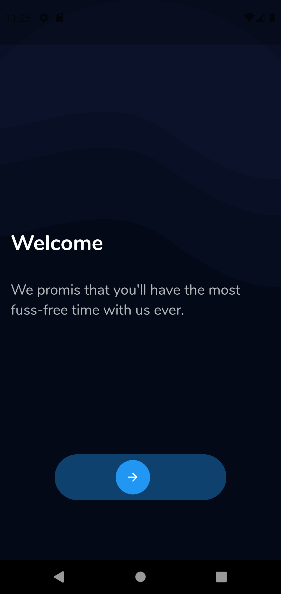&nbsp;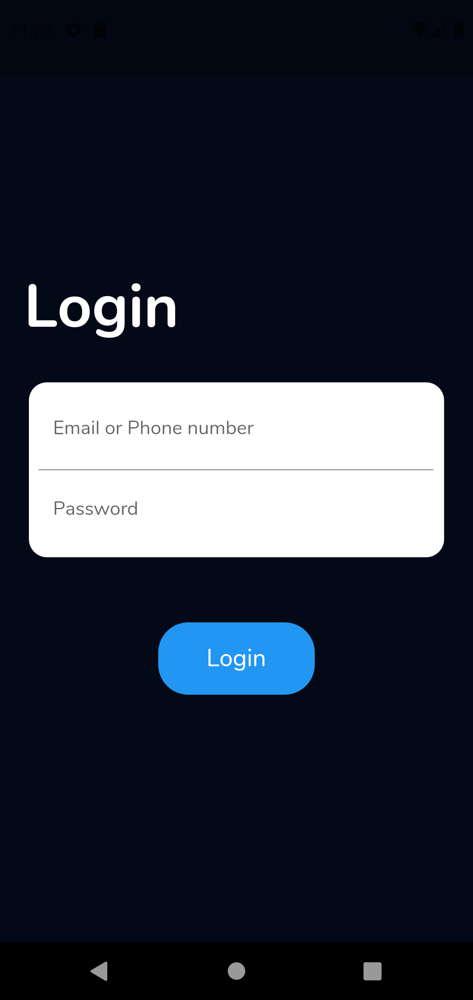

# day 9
&nbsp;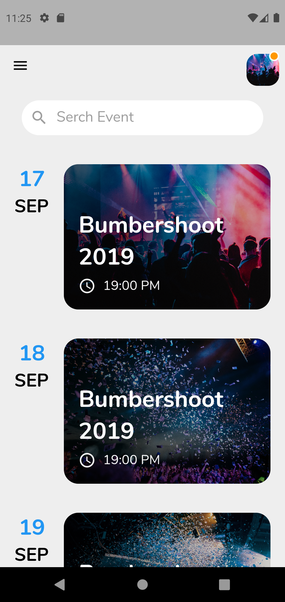

# day 10
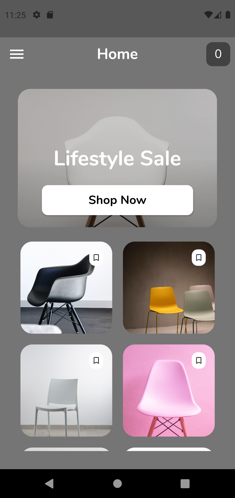
